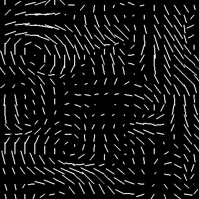

# APD: Advect, Project, Diffuse

[](https://crates.io/crates/apd)

APD is a simple fluid simulation library supports

- Advect
- Project
- Diffuse

operations.


# Examples

## Advect

```
cargo run --package advect --release 
```


## Project (and self advect)

```
cargo run --package project --release 
```



## Diffuse

```
cargo run --package diffuse --release 
```

